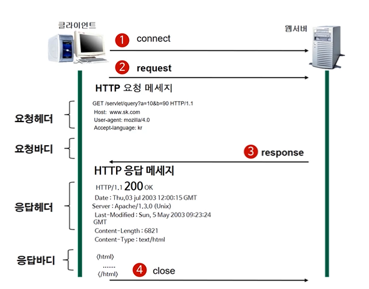

## FE/BE

중요사항

FE: 디자인을 위한 레이아웃 작업 >> CSS의 다양한 특성 이해

BE: 클라이언트 / 서버

### HTTP

인터넷(네트웍 통신)의 이해

**인터넷은 네트워크 들의 네트워크이다.**

WWW은 인터넷 기반의 서비스 중 하나이다.

| 이름  | 프로토콜       | 포트       | 기능               |
| ----- | -------------- | ---------- | ------------------ |
| WWW   | HTTP           | 80         | 웹서비스           |
| Email | SMTP/POP3/IMAP | 25/110/114 | 이메일서비스       |
| FTP   | FTP            | 21         | 파일전송 서비스    |
| DNS   | TCP/UDP        | 53         | 네임 서비스        |
| NEWS  | NNTP           | 119        | 인터넷 뉴스 서비스 |

#### HTTP (Hyptertext Transfer Protocol)

v0.9(1991년)  :arrow_right: v1.1 이용

- 어떤 종류의 데이터도 전송할 수 있도록 설계됨 (이미지, 비디오, 오디오, 텍스트 등)

- 서버와 클라이언트가 인터넷상에서 데이터를 주고 받기 위한 프로토콜

  

요청(클라이언트 → 서버), 응답(서버 → 클라이언트)

**Stateless(무상태)**는 서버가 응답하면, 클라이언트와 연결을 바로 끊음

​	장점: 최대 네트워크 사용 수보다 많은 클라이언트가 사용가능하다.

​	단점: 예전에 클라이언트의 정보를 기억하지 못한다. 해결 : 쿠키등장

#### URL (Uniform Resource Locator)

* 인터넷 상의 자원의 위치
* 특정 웹 서버의 특정파일에 접근하기 위한 경로 혹은 주소

접근 프로토콜://IP주소 또는 도메인 이름/문서의 경로/문서 이름

1) 클라이언트가 원하는 웹서버에 접속(connect)한다.

2) 클라이언트가 서버에 요청(request)한다.

* 요청 데이터 포맷

* 요청헤더: 

  ​	GET(요청메서드) /(요청자원) (HTTP 프로토콜의 버전)

  요청바디:

  ​	GET은 요청바디가 없다.

  ​	POST, PUT일 때는 있다.	

3) 응답부분 (response)

* 응답헤더

​	응답HTTP 프로토콜 버전 응답코드 응답메세지

​	날짜

​	웹서버

​	이름, 버전

​	컨텐츠 타입, 캐시 제어 방식, 길이, 방식 등 

​	(빈줄)

* 응답바디 : 실제 응답 리소스가 나옴

4) Close

