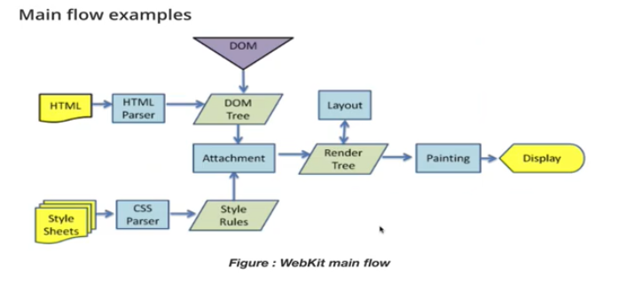
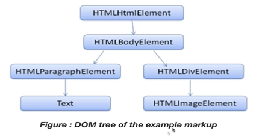
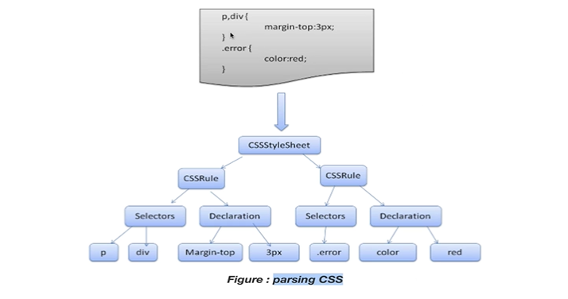
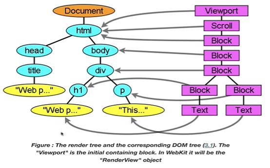

## 4. Browser의 동작

"How Browsers Work"

Browser Components

**UI** : User Interface

**Browser engine** : 브라우저를 동작시켜주는 엔진

**Rendering engine** : 브라우저 별로 다르다, 크롬은 크로미움 (V8 + Webkit)

Networking / js interpreter / UI Backend


* Rendering engine :

  1) HTML 파싱 → Dom tree를 만듦

  2) Render tree 생성

  3) Render tree의 레이아웃

  4) 화면에 직접 그림을 그림 





**HTML Parsing: Dom Tree**

```html
<html>
    <body>
        <p>
            Hello World
        </p>
        <div> 
        </div>
    </body>
</html>
```

tokenizer로 html이 parsing이 된다.




**CSS Parsing**

```css
p.div{
    margin-top:3px;
}
.error{
    color:red;
}
```



**Render Tree**




