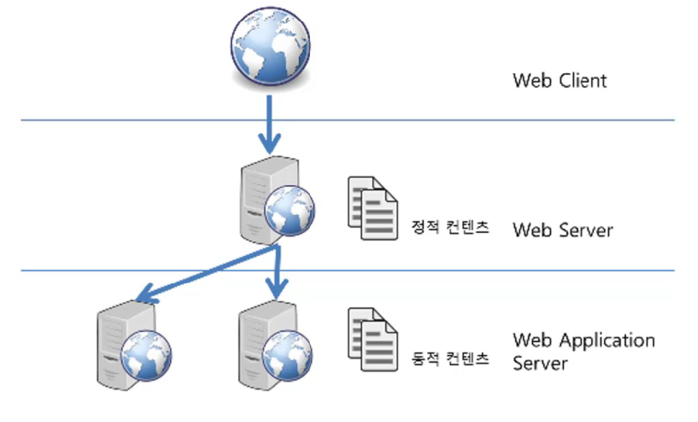

## 7. WAS

WAS (Web Application Server)

Apache Tomcat

### 클라이언트 / 서버 구조

클라이언트(client) -- 인터넷 -- 서버(server)

### DBMS(DataBase Management System)

최초의 구현 oracle

* 다수의 사용자들이 데이터베이스 내의 데이터를 접근할 수 있도록 해주는 SW

유저는 DMBS 인터페이스를 이용하여 데이터 작업요청을 효율적이고 빠르게 해결한다.

### 미들웨어(MiddleWare)

클라이언트 쪽에 비즈니스 로직이 많을 경우, 클라이언트 관리(배포 등)로 인해 비용 문제가 발생,

클라이언트와 DBMS 사이의 미들웨어 서버에서 비즈니스 로직을 작동시켜서,

클라이언트는 입/출력만 담당하도록 한다.

DBMS를 클라이언트가 직접 접속하여 일하는 것이 문제.

클라이언트는 중앙 서버에게 요청을 보내고, DB server에서 DBMS이용(데이터 조작시).

미들웨어는 그 결과를 클라이언트에게 보낸다.

클라이언트는 복잡한 로직이 사라지고, 화면의 결과만 전송하면 되기 때문에 크기도 작아졌고, 훨씬 쉬워졌다.

프로그램 로직이 바뀐다하더라도, 모든 클라이언트에게 배포할 필요가 없고, 중앙 미들웨어만 업데이트하면 된다.

### WAS

웹이 널리 쓰이면서, 동적인 기능 요구.

CGI로 간단한 동적기능은 가능하였지만,

웹이 점점 복잡해지고, DBMS와 연관된 복잡한 프로그래밍 요구, 웹에서의 미들웨어가 필요해졌다.

브라우저와 DBMS 사이의 미들웨어가 WAS

**WAS**도 넓게보면 **미들웨어**이다. 

>  WAS의 주요기능

1) 프로그램 실행환경, 데이터베이스 접속기능 제공

2) 여러개의 트랜잭션 관리

3) 업무를 처리하는 비지니스 로직 관리

트랜잭션은 논리적인 작업 단위이다.

### 웹서버 vs WAS

* WAS도 보통 자체적으로 웹 서버 기능을 내장한다.
* 자원 이용의 효율성 및 장애 극복, 배포 및 유지보수의 편의성을 위해, 웹 서버와 WAS를 대체로 분리한다.

Tomcat이라는 WAS를 설치하고, 따로 Apache 웹서버를 사용하지 않아도 된다.

Tomcat이 웹서버의 역할을 해주기 때문.

웹서버는 정적인 컨텐츠를 웹브라우저에게 전송,

WAS는 동적인 컨텐츠를 웹브라우저에게 전송, 현재는 정적인 컨텐츠도 성능상 큰차이 없이 처리.

규모가 커질수록, 웹서버와 WAS를 분리한다. 목적은 장애 극복기능(failover)인 경우가 많다.

failover 대용량 웹어플리케이션에서 중요한 기능을 한다. 이를 이유로 WAS가 웹서버 앞단에서 동작하도록 한다.

