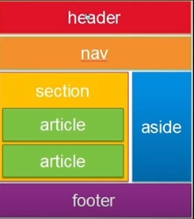

## 1. HTML Tags

tag 종류 (의미에 맞추어 사용해야 한다.)

* 링크
* 이미지
* 목록
* 제목


google - html tag list 검색.


anchor 태그, img, ul/li, heading, p 태그 등이 자주 이용됨

div 태그는 특별히 block 엘리먼트라고 하고, 일반적인 영역을 표현할 때 가장 많이 사용한다.


## 2. HTML Layout 태그

레이아웃은 '배치'를 의미하고, HTML 태그로 감싸진 각 정보요소를 화면상의 특정 공간에 위치하도록 결정

* 상단 <header>

* 하단 <footer>
* section
* nav
* aside

HTML5 layout tag 검색



```html
<html>
	<head>
		
	</head>
	<body>
		<header>header</header>
		<div id="container">
			<nav><ul>
				<li>home</li>
				<li>news</li>
				<li>sports</li>
			</ul></nav>

			<aside><ul>
				<li>logout</li>
				<li>Today's weather</li>
				<li>luck</li>
			</ul></aside>
		</div>
		<div>
			<h1>Hello </h1>
			Here are some fruits.
			<ul>
				<li><a href="www.apple.com">apple</a></li>
				<li>banana</li>
				<li>melon</li>
				<li>orange</li>
			</ul>
		</div>
	</body>
</html>

```


